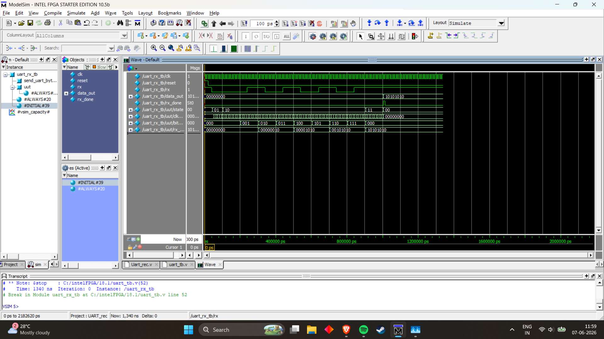

# UART Receiver (Verilog HDL)

## Overview

This project implements a UART (Universal Asynchronous Receiver Transmitter) Receiver using Verilog HDL.

The receiver monitors a serial input line (`rx`), detects the start bit, samples incoming serial data bits, reconstructs the original 8-bit parallel data, and asserts a completion flag when reception is successfully completed.

The design is implemented using a Finite State Machine (FSM) and verified through ModelSim simulation.

---

## Project Objective

The objective of this project is to understand the working principles of UART communication and implement a hardware-based UART Receiver capable of:

- Detecting UART start bits
- Receiving serial data
- Converting serial data into parallel format
- Validating stop bits
- Indicating successful data reception

---

## Features

- UART Serial-to-Parallel Conversion
- FSM-Based Architecture
- Start Bit Detection
- 8-Bit Data Reception
- Stop Bit Validation
- Bit Counter Implementation
- Reception Complete Flag (`rx_done`)
- Fully Verified Using ModelSim

---

## UART Frame Format

The UART Receiver supports the following frame structure:

| Start Bit | Data Bits | Stop Bit |
|------------|------------|-----------|
| 0 | 8 Bits (LSB First) | 1 |

Example UART Frame:

```text
0 01010101 1
```

Expected Output:

```text
10101010
```

---

## FSM Architecture

The UART Receiver operates using the following finite state machine:

```text
IDLE
  ↓
START
  ↓
DATA
  ↓
STOP
  ↓
DONE
  ↓
IDLE
```

### State Description

| State | Function |
|---------|-----------|
| IDLE | Waits for start bit detection |
| START | Confirms valid start bit |
| DATA | Receives and stores incoming data bits |
| STOP | Validates stop bit |
| DONE | Updates output and asserts rx_done |

---

## File Structure

```text
UART_Receiver/
│
├── README.md
├── Uart_recv.v
├── uart_tb.v
└── image.png
```

| File | Description |
|--------|-------------|
| Uart_recv.v | UART Receiver RTL Design |
| uart_tb.v | UART Receiver Testbench |
| image.png | ModelSim Simulation Waveform |
| README.md | Project Documentation |

---

## Simulation Waveform

The UART Receiver was verified using ModelSim simulation.

The waveform demonstrates:

- Detection of the UART start bit
- Sequential reception of all 8 data bits
- Bit counter progression
- Data reconstruction process
- Assertion of `rx_done`
- Successful transfer of received data to `data_out`



---

## Verification Results

### Test Case

Input Serial Data:

```text
10101010
```

UART Frame:

```text
Start Bit : 0
Data Bits : 10101010
Stop Bit  : 1
```

Output:

```text
data_out = 10101010
rx_done  = 1
```

### Result

✅ Start bit detected successfully

✅ All 8 bits received correctly

✅ Stop bit validated

✅ Parallel data reconstructed correctly

✅ Reception completion flag asserted

---

## Tools Used

- Verilog HDL
- ModelSim Intel FPGA Starter Edition
- GitHub

---

## Applications

UART Receivers are widely used in:

- Microcontrollers
- Embedded Systems
- Arduino Boards
- ESP32 Development
- Raspberry Pi Interfaces
- GPS Modules
- Bluetooth Modules
- Serial Communication Systems

---

## Learning Outcomes

Through this project I gained practical experience in:

- UART Communication Protocol
- Finite State Machine Design
- Serial-to-Parallel Data Conversion
- RTL Design Using Verilog
- Testbench Development
- Waveform Analysis and Debugging
- Digital Communication Systems

---

## Future Improvements

Possible enhancements include:

- Configurable Baud Rate
- Parity Bit Support
- Error Detection
- FIFO Buffer Integration
- Full UART Transceiver (TX + RX)
- FPGA Hardware Implementation

---

## Author

**Shiv Sriram V**

Electronics & Communication Engineering Student

Aspiring RTL Design & VLSI Engineer


