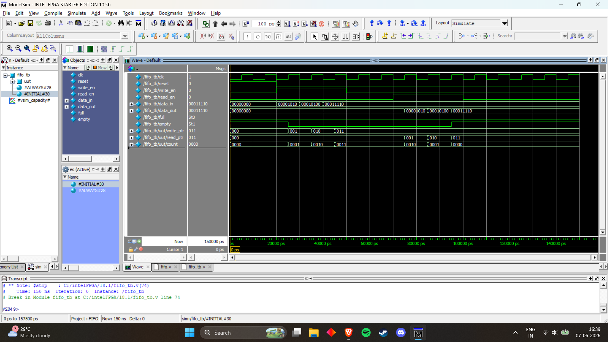

## Simulation Waveform

The FIFO was verified using ModelSim simulation.

The waveform below demonstrates:

- Writing data values **10**, **20**, and **30** into the FIFO
- Incrementing the **write pointer**
- Incrementing the **occupancy counter**
- Reading data values in the same order they were written
- Incrementing the **read pointer**
- Decrementing the **occupancy counter**
- Correct operation of the **Empty** flag

### ModelSim Simulation Result



---

### Verification Summary

#### Data Written

```text
10
20
30
```

#### Data Read

```text
10
20
30
```

#### Write Pointer Activity

```text
0 → 1 → 2 → 3
```

#### Read Pointer Activity

```text
0 → 1 → 2 → 3
```

#### FIFO Count Activity

```text
0 → 1 → 2 → 3
3 → 2 → 1 → 0
```

#### Status Flags

```text
empty : 1 → 0 → 1
full  : 0
```

The simulation confirms correct FIFO functionality and validates the **First-In First-Out (FIFO)** behavior of the design.
